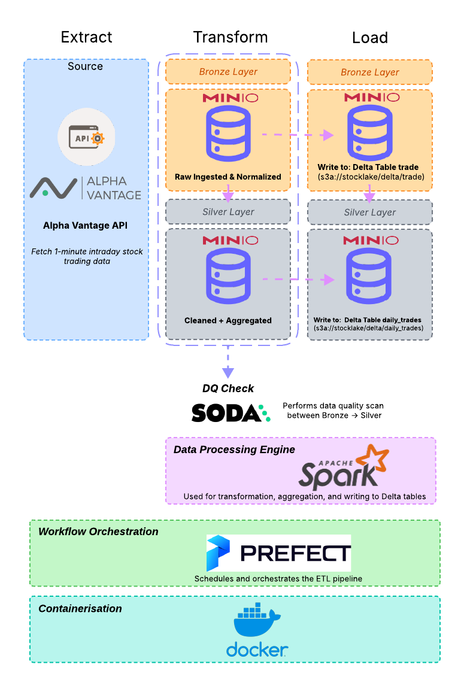

# End-to-End ETL Pipeline for Real-Time Stock Trading

## Project Overview
This project is an end-to-end ETL pipeline designed to process near real-time stock trading data using the Alpha Vantage API. It leverages PySpark, Delta Lake, and a MinIO (S3-compatible) data lake to store and transform raw intraday trading data into structured daily aggregates. The pipeline integrates data engineering best practices including workflow orchestration with Prefect, containerized deployment using Docker, and data quality validation through Soda.

This architecture illustrates how stock data flows from an API source into MinIO object storage, gets processed and structured via Apache Spark into Delta Lake tables. Prefect orchestrates the entire workflow while Soda ensures data quality, all within a Dockerized and automated environment.

## Project Architecture




## Features
* Retrieve intraday stock trading data from Alpha Vantage API
* Normalize and ingest raw JSON data into Bronze Delta Lake layer
* Aggregate data into daily-level statistics in Silver Delta Lake layer
* Perform data validation using Soda with YAML-based test rules
* Schedule and monitor workflows with Prefect 2.0
* Fully containerized using Docker and Docker Compose

## Tech Stack
| Component | Technology |
|-----------|------------|
| Programming | Python, PySpark |
| API Source | Alpha Vantage |
| Data Storage | MinIO (S3), Delta Lake |
| Data Processing | Apache Spark |
| Data Quality | Soda |
| Orchestration | Prefect |
| Containerization | Docker, Docker Compose |
| Automation | Makefile, setup.sh |

## Project Structure
```
Stock_ETL_Pipeline/
├── Dockerfile
├── docker-compose.yml
├── Makefile
├── README.md
├── requirements.txt
├── setup.sh
├── stocklake/
│   ├── config/
│   │   └── config.ini
│   ├── data_quality/                  # Soda YAML checks
│   ├── delta_tables/                 # Bronze and Silver layer definitions
│   ├── pipelines/
│   │   ├── api_utils/                # API handlers and data fetching
│   │   ├── dq_utils.py               # Soda scan integration
│   │   ├── etl_utils.py              # Ingest, read, Spark session, S3 utils
│   │   ├── transform.py              # Transformation logic
│   │   ├── stock_etl.py              # Main Prefect Flow for ETL
│   │   ├── api_to_csv_flow.py        # Optional: store raw API results as CSV
│   └── sample_files/
```

## ETL Flow Summary
1. **Extract**
   * Fetch intraday time series data using Alpha Vantage API
   * Optional: Write raw API responses to CSV files for audit/debugging

2. **Load to Bronze**
   * Normalize and cast raw JSON into Spark DataFrame (`transform.py`)
   * Append to Delta Lake Bronze table: `s3a://stocklake/delta/trade`
   * Perform Soda DQ checks on required fields (e.g., no nulls, valid volumes)

3. **Transform to Silver**
   * Aggregate data into daily statistics using Spark window functions
   * Columns: `daily_open`, `daily_close`, `high`, `low`, `volume`
   * Write to Silver Delta table: `s3a://stocklake/delta/daily_trades`
   * Apply further DQ validation rules via Soda (`daily_trades.yml`)

4. **Orchestration with Prefect**
   * Main pipeline defined in `stock_etl.py` as Prefect `@flow`
   * Tasks modularized for extraction, transformation, ingestion, and validation
   * Deployable with cron schedule or ad-hoc execution

## Deployment Guide
1. Register for an API key at https://www.alphavantage.co/support/#api-key

2. Store your API key in `stocklake/config/config.ini`:
   ```
   [API]
   api_key = YOUR_API_KEY
   ```

3. Launch the pipeline environment:
   ```
   docker-compose up --build
   ```

4. Run manually:
   ```
   python3 stocklake/pipelines/stock_etl.py
   ```

5. Or schedule with Prefect:
   ```
   prefect deployment build stocklake/pipelines/stock_etl.py:daily_etl -n daily --cron '0 1 * * *'
   prefect deployment apply daily_etl-deployment.yaml
   ```

## Notes
* You can modify tracked stocks by editing `COMPANY_PARAMS` in `stock_etl.py`
* Delta tables are stored in `s3a://stocklake/delta/`
* MinIO bucket `stocklake` is initialized automatically by the `createbuckets` service


